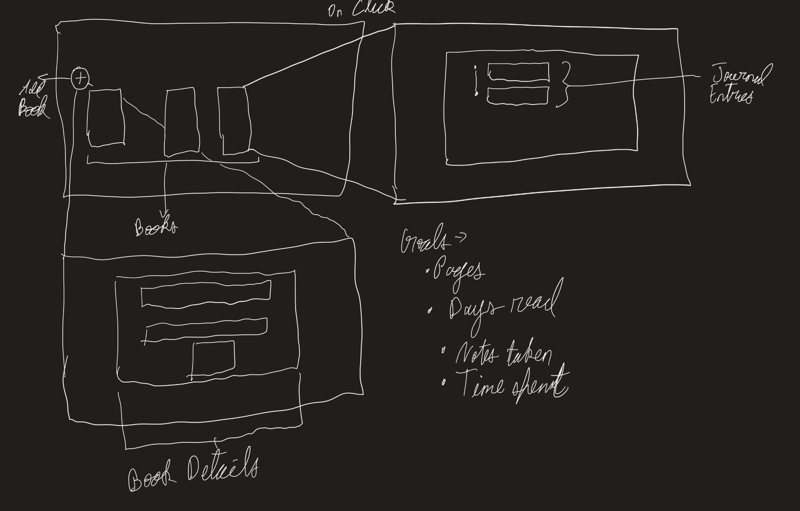

<div align="center">

<h1 style="font-family:Consolas, monospace;">Project 1 – Documentation</h1>
<h3 style="font-family:Consolas, monospace;">CS5167 – Raihan Rafeek</h3>

</div>

---

This document provides an overview of the project, outlining its design process, the interviews conducted, and a demonstration of the final application.

The application that I am building focuses on a reading journey. Keeping track of books you read, how you feel about them, and pushing you to be consistent with reading on a weekly basis.

<h2 style="font-family:Consolas, monospace;">1. Interviews</h2>
To get insights on how I should build this project, I interviewed two of my friends who are avid readers. The questions I asked during the interviews were:

```
1. Do you read e-books or physical books?
2. How do you currently keep track of what books you read?
3. How do you keep track of where you are in a specific book, and how you feel in it?
4. How does your reading process generally go? Do you take notes?
5. Do you prefer a digital, or software medium to take notes?
6. How do you usually reflect on how it feels to read a specific book?

```
For each interview, I will be writing down te key insights gathered from them and how I could use them to build on my application.

<p>

**Interview 1 - AM**
Upon interviewing AM, who has been reading books since a very young age, I had very interesting insights to build upon.

The key insights from the interview are as follows:
1. AM likes to annotate in books to write down how she feels about certain phrases or sentences.
2. AM does not journal, rather re-reads the pages that have annotations to recollect the story.
3. AM did mention however, that re-tracing back to _where_ exactly the annotations were is sometimes hard for books that haven't been read in a while.
4. AM also mentioned that even though she annotates, it is almost impossible to imagine or recall how she felt when reading those pages.

From this interview, we can see that an experienced reader often doesn't need to journal, but rather remembers the chunks of her books. The most interesting observation from this interview was regarding the feelings associated to pages or parts of books.

<p>

**Interview 2 - SP**
SP is not a very avid reader, but occasionally reads in both academic and recreational backgrounds. SP gave me good insights as a person who currently uses tools to keep track of his reading. He uses the notes app on his phone to keep track of books he reads, and wants to read, and sometimes a rating on them.

The key insights from the interview are as follows:
1. SP does not like annotating and likes to keep books pristine, rather writes notes either on his phone or on a piece of paper.
2. SP mentioned being inconsistent with reading because there is no incentive to it at times apart from recreation, and there is no way to make sure he is being consistent with it.
3. He uses applications like 'Hevy' and 'MyFitnessPal' to journal other aspects of his daily life, and expressed the need for something similar for reading.

These insights are interesting because SP already uses applications that journal aspects of his life.

<h4 style="font-family:Consolas, monospace;">1.1 Interview Insights</h4>

From the two interviews, several key themes emerged that highlight different reading behaviors and challenges:

- **Annotation vs. Journaling**
  AM prefers to annotate directly in books, using markings as anchors to revisit meaningful passages. SP, on the other hand, avoids writing in books and instead relies on external tools like phone notes or paper. This shows two contrasting approaches to capturing reading experiences.

- **Memory and Recall**
  AM’s challenge lies in retracing the exact location of annotations and reconnecting with the emotions she had while reading. SP’s challenge is not about recall, but about consistency.

- **Digital Tools and Support**
  While AM relies solely on physical annotations, SP already integrates digital tools into his daily life (e.g., fitness and journaling apps). He expressed interest in having a similar structured system for reading, suggesting that readers may be open to technology-driven solutions.

**Summary:**
The interviews suggest that a reading-support application should address two core needs:
1. Helping readers connect back to the *emotional context* of their reading (as raised by AM).
2. Encouraging *consistency and structured tracking* of reading habits (as raised by SP).

These insights form the foundation for designing an application that supports both emotional engagement and disciplined tracking.


<h2 style="font-family:Consolas, monospace;">2. Design Process</h2>

Taking insights from the interviews, this is the first iteration I came up with. I wanted to go with a 2-stage design.



<h2 style="font-family:Consolas, monospace;">3. Feedback</h2>

<h2 style="font-family:Consolas, monospace;">4. Implementation</h2>