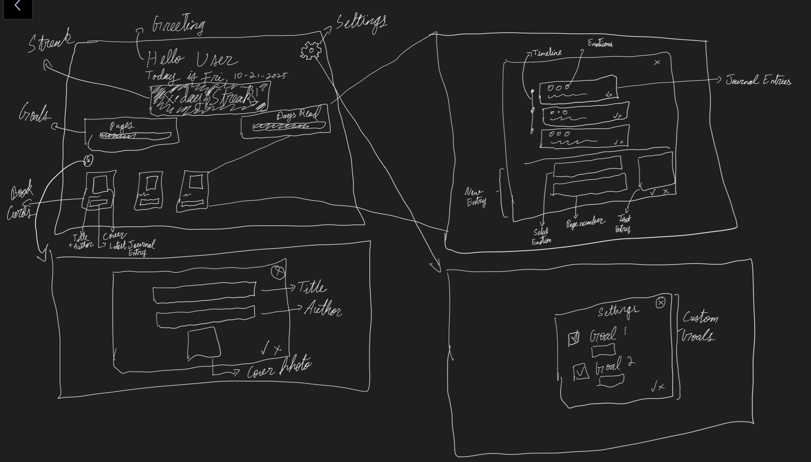
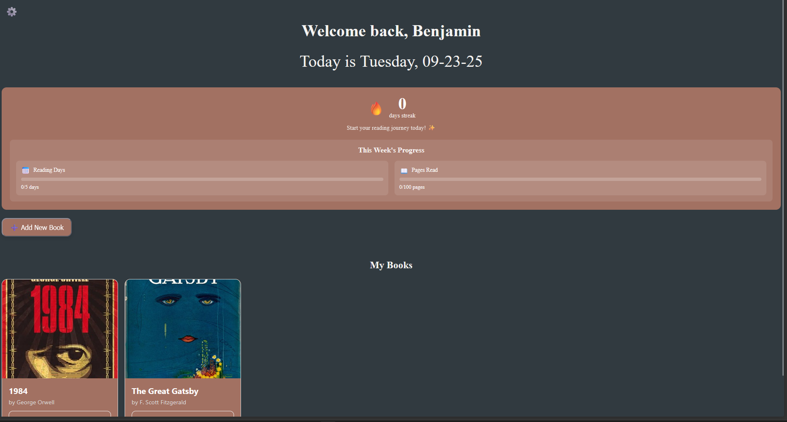
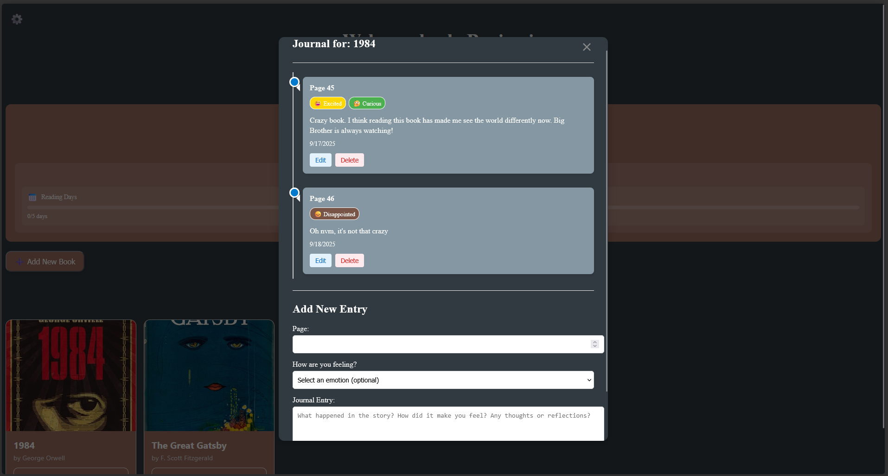
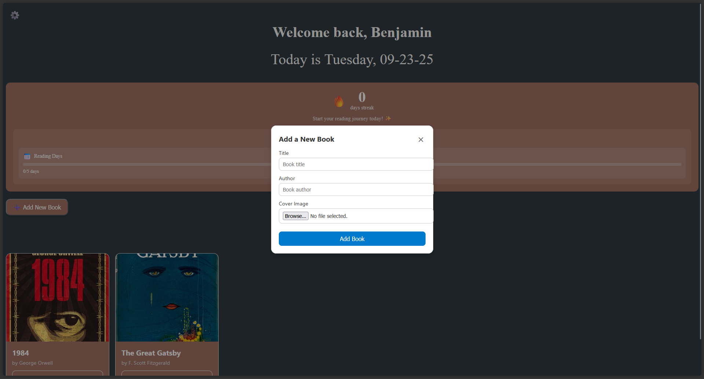
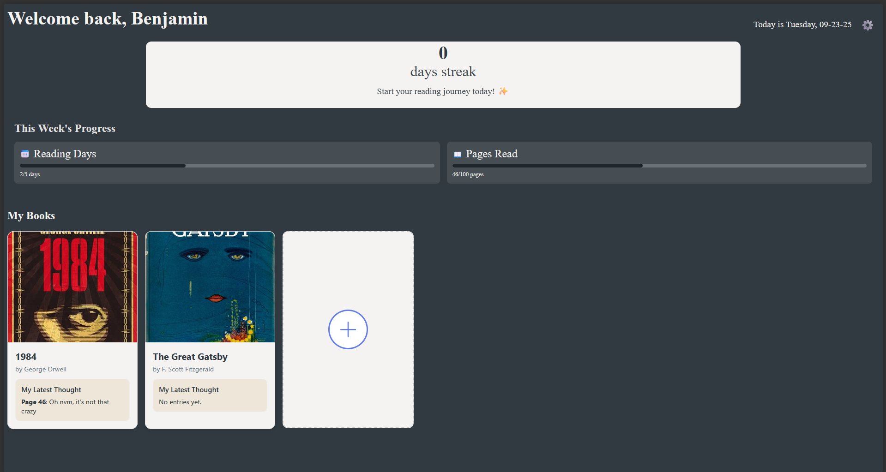
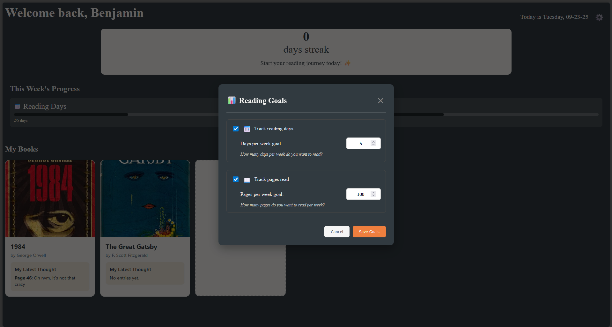
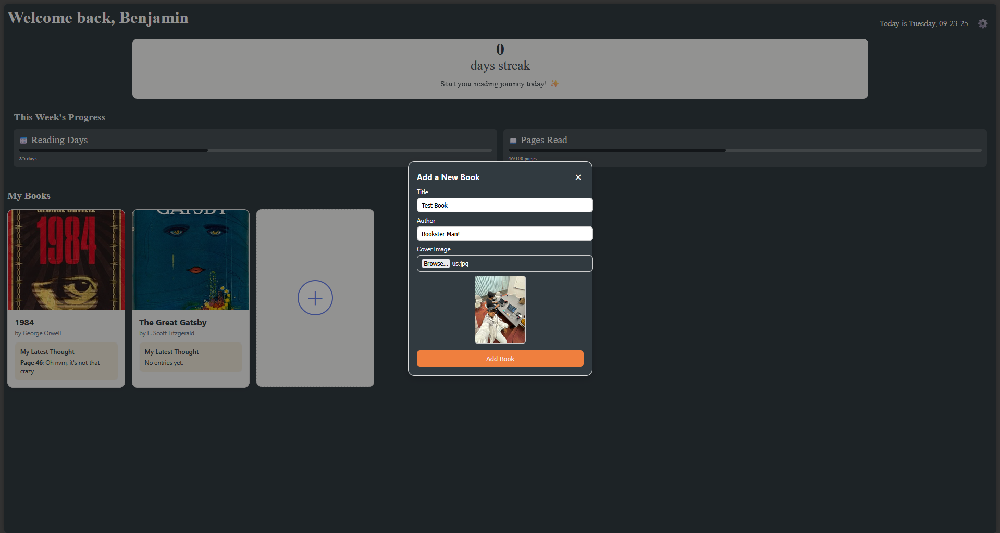
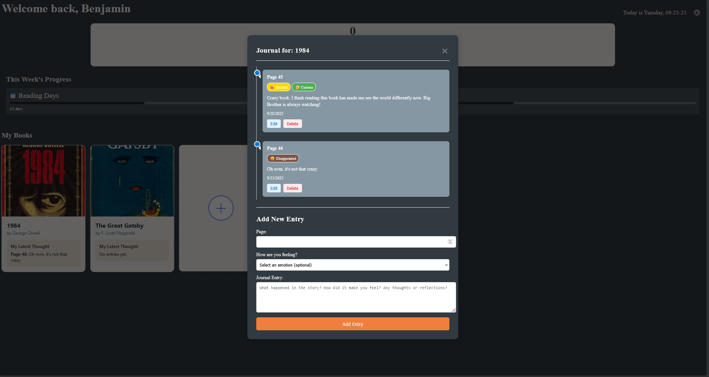

<div align="center">

<h1 style="font-family:Consolas, monospace;">Project 1 – Documentation</h1>
<h3 style="font-family:Consolas, monospace;">CS5167 – Raihan Rafeek</h3>

</div>

---

This document provides an overview of the project, outlining its design process, the interviews conducted, and a demonstration of the final application.

The application that I am building focuses on a reading journey. Keeping track of books you read, how you feel about them, and pushing you to be consistent with reading on a weekly basis.

<h2 style="font-family:Consolas, monospace;">1. Interviews</h2>
To get insights on how I should build this project, I interviewed two of my friends who are avid readers. The questions I asked during the interviews were:

```
1. Do you read e-books or physical books?
2. How do you currently keep track of what books you read?
3. How do you keep track of where you are in a specific book, and how you feel in it?
4. How does your reading process generally go? Do you take notes?
5. Do you prefer a digital, or software medium to take notes?
6. How do you usually reflect on how it feels to read a specific book?

```
For each interview, I will be writing down te key insights gathered from them and how I could use them to build on my application.

<p>

**Interview 1 - AM**
Upon interviewing AM, who has been reading books since a very young age, I had very interesting insights to build upon.

The key insights from the interview are as follows:
1. AM likes to annotate in books to write down how she feels about certain phrases or sentences.
2. AM does not journal, rather re-reads the pages that have annotations to recollect the story.
3. AM did mention however, that re-tracing back to _where_ exactly the annotations were is sometimes hard for books that haven't been read in a while.
4. AM also mentioned that even though she annotates, it is almost impossible to imagine or recall how she felt when reading those pages.

From this interview, we can see that an experienced reader often doesn't need to journal, but rather remembers the chunks of her books. The most interesting observation from this interview was regarding the feelings associated to pages or parts of books.

<p>

**Interview 2 - SP**
SP is not a very avid reader, but occasionally reads in both academic and recreational backgrounds. SP gave me good insights as a person who currently uses tools to keep track of his reading. He uses the notes app on his phone to keep track of books he reads, and wants to read, and sometimes a rating on them.

The key insights from the interview are as follows:
1. SP does not like annotating and likes to keep books pristine, rather writes notes either on his phone or on a piece of paper.
2. SP mentioned being inconsistent with reading because there is no incentive to it at times apart from recreation, and there is no way to make sure he is being consistent with it.
3. He uses applications like 'Hevy' and 'MyFitnessPal' to journal other aspects of his daily life, and expressed the need for something similar for reading.

These insights are interesting because SP already uses applications that journal aspects of his life.

<h4 style="font-family:Consolas, monospace;">1.1 Interview Insights</h4>

From the two interviews, several key themes emerged that highlight different reading behaviors and challenges:

- **Annotation vs. Journaling**
  AM prefers to annotate directly in books, using markings as anchors to revisit meaningful passages. SP, on the other hand, avoids writing in books and instead relies on external tools like phone notes or paper. This shows two contrasting approaches to capturing reading experiences.

- **Memory and Recall**
  AM’s challenge lies in retracing the exact location of annotations and reconnecting with the emotions she had while reading. SP’s challenge is not about recall, but about consistency.

- **Digital Tools and Support**
  While AM relies solely on physical annotations, SP already integrates digital tools into his daily life (e.g., fitness and journaling apps). He expressed interest in having a similar structured system for reading, suggesting that readers may be open to technology-driven solutions.

**Summary:**
The interviews suggest that a reading-support application should address two core needs:
1. Helping readers connect back to the *emotional context* of their reading (as raised by AM).
2. Encouraging *consistency and structured tracking* of reading habits (as raised by SP).

These insights form the foundation for designing an application that supports both emotional engagement and disciplined tracking.


<h2 style="font-family:Consolas, monospace;">2. Design Process</h2>
In this section, I will be documenting my design process. The decisions made here are based on insights from interviews, and feedback from friends, classmates and the professor too!

<h3 style="font-family:Consolas, monospace;">2.1 Initial Sketch</h3>
Taking insights from the interviews, this is the first iteration I came up with. I wanted to go with a 2-stage design.


In this design, there would be a main page with cards representing books, and a plus button to add new books. The book card would show essential details like the name, author and a smaller box would showcase the last journal entry.

Upon clicking a book card, you would be greeted by a modal screen that showcases the journal entries in a time-series mode, based on pages or chapters in the book.
You will also be able to add new journal entries within the same modal.

Finally, the third page is the modal that pops up when you click the (+) button. This modal screen will let you add books, including the title, author and a picture of the cover.

At this point, I have some ideas for goals to keep the reader accountable, but I do not intend on using all of them. The ones I have written down for now are:
1. Number of pages
2. Dayes in the week a book is read
3. How many notes have been taken
4. The amount of time spent reading

**-- Feedback to Initial Sketch --**
I returned to AM and SP to get feedback on these drawings. I recieved both generic as well as specific feedback about features they liked and ones they didn't. This helped me shape my goals better to come up with more sketches.

The key feedback that I recieved was:
1. Format of app is good; focuses mainly on books while allowing users to journal.
2. Positive feedback regarding time-series based on pages to report journals.
3. Suggested to put emoticons to keep track of emotions associated to journal entries
4. Approval of 'Pages' and 'Days Read' goals, but disapproval of 'Notes Taken' and 'Time Spent Reading' goals.
5. Suggested having progress bars for custom goals.

<h3 style="font-family:Consolas, monospace;">2.2 Second Sketch</h3>
With the feedback from the first sketch, I developed a second sketch which is much more detailed. The key feedback that I took from the previous sketch into this one was that I need to build on top of the current schematic, but work on integrating the goals into it. 



The home screen in this sketch has a welcome message, greeting the user with their name and stating today's date. Below it, there is a streak mentioned. This streak keeps track of how many days in a row the user has been reading.

We also have progress bars for the goals now, which shows the number of pages read, and how many days the user has read this week.

Right below it is the book card section. This shows the different books the users have registered using the plus icon above it. Each book card has a cover photo, the title and author and the most recent journal entry shortened.

Clicking on the plus icon (+) above the book cards leads you to the book creation modal. Here, you enter the book title, author name and upload a cover photo. 

Clicking on a book card will open up hte journal entry modal. This is similar to the previous sketch, except here each card also includes emoticons which will be recorded while submitting. The interface to enter new entries is right below the container, which takes in the page number, emoticons and a text entry.

Finally, we now have a defined settings modal (opened by clicking on the cog on the top right), which includes the goal settings. Here, you can set specific numbers for each goal, and also decide whether you want the specific goal to be shown or hidden.

<h2 style="font-family:Consolas, monospace;">3. Implementation</h2>

Using these sketches, I implemented the UI using Svelte as part of the course requirements. I went through two iterations making this as well. Initially, I made a version that was very close to fully functional. Upon taking feedback from the Professor on my implementation, I made more changes before submitting.

First, I will briefly describe the initial iteration, and it's flaws before describing the final implementation.

<h3 style="font-family:Consolas, monospace;">3.1 First Implementation</h3>
Here is the initial implementation of the sketches. It features a home page with a welcome message for the user along with the date. There is a central box for the streak and user goals. Below the goals are the book cards and the 'Add Book' button as discussed.



Upon clicking a book card, you are greeted with the journal entry screen. This screen showcases the past entries as well as a portal for you to enter the new journal entry.



Finally, clicking the 'Add New Book' button would open up the modal to create a new book, including the author name, title and a cover photo upload.



Besides this iteration being functional, it lacked in a lot of aspects that I needed to work on. After testing and making observations myself, with AM and SP as well as the professor, I came up with the following list of changes to be made.

1. **Bad use of colors**: Even though the current color scheme includes complementary colors, it is not very well used. Some accents feel shadowed while some irrelevant items feel highlighted.
2. **Incosistent UI Elements**: I experimented a lot while building this, which lead to a few inconsistencies in the elements. The buttons didn't match in color, and the CSS for some of the modals were incomplete.
3. **Bad Placement of 'Add New Book' Button**: A key highlight to me from the feedback from Professor Jillian was that the 'Add New Book' button feels misplaced and intrusive. Thus, I spent some time trying to integrate it better.
4. **Half-Baked Features**: Some of the features in the application like editing journal entries, having entries show up in live time (event listeners), editing book names etc. that weren't working.
5. **Bad Use of Whitespace**: Some of the elements take up more space than required and are not making full use of the screen real-estate.

Given these action items, I went on to work on the next iteration where I attempted to fix these issues.

<h3 style="font-family:Consolas, monospace;">3.2 Second Implementation</h3>

This implementation is the one that I stuck with. Taking feedback from the previous implementation, I cleaned up the colors, removed some of the whitespace to make it seem more airy and casual, and also finished up features. There are only two features I could not finish on time, which are _editing and deleting books_. I included hover buttons, but I did not get time to set up listeners for them.

Below is the home page. In this page, the items shown are the same as above, but it has been cleaned up. The day streak is the center of attention, to remind the user to be accountable. Right below them are the progress bars for the user goals, to show them how well or how bad they are doing on them. Finally, the books are the last thing on the page with a much cleaner 'Add New Books' button that doesn't intrude! (I made it the shape of a book card so it looks obvious what you are adding).


Using the settings button on the top right of the screen, you can access the settings modal. Through this modal, you can add, remove, and edit goals specifically to your needs.


Similarly, hitting the (+) icon for adding a new book greets you with a modal that has options to upload a cover picture, and two text boxes for book title and author name.


Finally, the journal entry modal! This is almost exactly the same as the first iteration, except the buttons accent has been changed. All affirmative the buttons in the app were changed to orange to be uniform with the theme.


Here is a video demonstration of how the app works as a whole!

[](https://www.youtube.com/watch?v=01C-fYs4ICk)